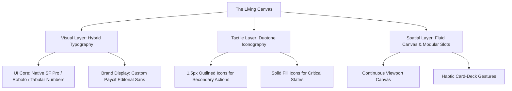

# Paycif Design Board Consensus: Next-Generation UI Architecture Specification

**Date:** July 10, 2026  
**Document Reference:** Paycif-Arch-Consensus-2026-V1.0  
**Location:** Cupertino & San Francisco (Virtual Boardroom)  

---

## 1. Executive Summary & Design Vision

This specification defines the ultimate typography, iconography, and physical layout architecture for **Paycif**. Departing entirely from traditional, rigid grid-based mobile wallets, the board has aligned on a revolutionary paradigm: **"The Living Canvas."** 

This architecture is optimized for 120Hz OLED displays, high-speed outdoor scanning, and rapid thumb-driven micro-transactions. It balances developer-grade data precision with a bold, tactile personality that commands digital currency trust in Southeast Asia.



---

## 2. The Boardroom Debate: Transcripts & Perspectives

### Round 1: Typography — Tabular Monospace vs. Proportional, & Native vs. Brand Face

*The session opens with a debate on typography. The key tension is between absolute reading speed/data alignment and brand-building visual distinction.*

*   **Katie Dill (Stripe):** "Look, we are dealing with financial amounts that update in real-time. If you use proportional fonts for balances, the numbers bounce and jitter. It's incredibly distracting and looks amateur. We need tabular, monospaced figures for all numerical values. At Stripe, readability of numerical data is sacred. We need clean, rigid columns of digits so the eye can scan a balance or a fee instantly."
*   **Stephen Lemay (Apple):** "We don't need a pure monospace font to achieve that, Katie. SF Pro has OpenType features with built-in tabular lining figures (`font-variant-numeric: tabular-nums`). If we use a custom brand font, we risk rendering latency on 120Hz displays. Native platform fonts are pre-rasterized and cached at the GPU level, delivering zero-dropped-frame rendering. We should stick to SF Pro on iOS and Roboto/Roboto Flex on Android for all interactive UI."
*   **David Fock (Klarna):** "Stephen, that's incredibly sterile. If everything is native SF Pro, Paycif looks like a settings page. We want users to feel something when they pay. We need a custom, high-personality brand typeface—something with sharp terminals and editorial weight for major headings and brand moments. We can isolate native fonts for the dense data, but the soul of the app needs custom typography."
*   **Orlando Baeza (Chime):** "I agree with David on personality, but accessibility has to be the ceiling. If we use a display font with extreme line weights or quirky shapes, we exclude users with visual impairments. In Southeast Asian street markets, users are paying under harsh sun glare. High x-height, open counters, and robust weight hierarchy are non-negotiable. If we use a custom font, it must be customized specifically for legibility under stress."
*   **Josh Payton (Wise):** "At Wise, we handle multi-currency balances where numbers get long. A proportional sans-serif makes long numbers hard to parse. But a strict monospaced font like SF Mono occupies too much horizontal real estate on small mobile screens. The compromise is simple: a native-fallback sans-serif using strictly forced tabular numerals for all inputs, balances, and exchange rates, and a curated brand sans for layout headers."

---

### Round 2: Iconography Style — Line Weights, Grids, and Scalability

*The conversation moves to the visual language of actions and states. The board debates the balance between lightweight minimalism and solid, interactive visual targets.*

*   **Robert Andersen (Cash App):** "We need custom, tactile icons. Flat, thin icons feel cold and distant. I'm advocating for thick, 2px stroke icons with slightly rounded caps and a chunky, friendly energy. When you tap a button on Cash App, you should feel like you're pressing a physical button. Icons shouldn't be whisper-thin vector lines; they need weight and physical presence."
*   **Connie Yang (Coinbase):** "I have to push back on 2px strokes across the board, Robert. When you scale down to 16px utility icons in dense ledger lists, 2px strokes turn into muddy blocks. I suggest a hybrid iconography: 1.5px stroke weight for secondary navigation and details to maintain precision, but full solid fill for primary action buttons and transactional states (success, failure, warning). That gives us the best of both worlds—lightweight navigation and high-contrast primary targets."
*   **Alexandre Deffenain (Revolut):** "Connie's hybrid approach makes sense. In Revolut, we found that mixed weights look messy if not strictly governed. We must establish a strict 24px bounding grid. The active visual area should be limited to 20px, leaving a 2px safety margin on all sides. All icons must share the exact same corner radius—say 2px or 3px—so they feel like they belong to the same family, whether they are outline or solid."
*   **Baiju Bhatt (Robinhood):** "We should also look at icon colors. Icons aren't just shapes; they are guidance systems. Success states must use solid fill with micro-spring animations. Outline states should be reserved for passive, non-interactive visual indicators. Let's make the primary action icons feel like they have weight and depth through subtle, dual-tone layering."

---

### Round 3: Layout Architecture — Spatial Canvas vs. Modular Slots vs. Card Decks

*The final round addresses the core structural layout of Paycif. Traditional fintech apps rely on tab bars and static list views. The board seeks a layout that feels fluid, unified, and native to a high-refresh gesture-first OS.*

*   **Ethan Eismann (Nubank):** "The traditional tab-bar layout is dead. In Brazil, we saw that users hate navigating deep hierarchies just to scan a code or show a barcode. The camera scanner should be the primary physical anchor, but instead of sheets just overlaying the screen, we need a modular slot system. The screen should be a vertical, infinite-feeling canvas where widgets snap into slots based on context (e.g., location, time of day, frequent merchants)."
*   **Alexandre Deffenain (Revolut):** "A 'Living Canvas' is the right term. The UI should float on a spatial depth plane. When the user swipes up, the camera doesn't disappear; it blurs into the background, and a fluid grid of modular dashboard slots smoothly slides up. We should use standard grid columns (a 4-column layout on mobile) where widgets can occupy 2x2, 4x2, or 4x4 blocks dynamically."
*   **Stephen Lemay (Apple):** "If we do a single-canvas layout, it must follow physical momentum and haptic response. We can't have unpredictable layout shifts. If widgets are snapping and morphing, the animation duration must match the system standard of 250ms with custom spring-damping (no bounce for layout, light bounce for transaction confirmation). We must also ensure standard navigation fallbacks for screen readers."
*   **Orlando Baeza (Chime):** "Let's make sure the spatial layout doesn't feel chaotic. Older users get confused if things move unexpectedly. Let's establish that the layout has fixed structural slots. The top slot is always the Scanner/Camera, the middle slot is the Core Account Balance, and the bottom slot is the Interactive Card Deck. The card deck can scroll horizontally, but the main canvas only scrolls vertically."
*   **Robert Andersen (Cash App):** "Yes! The bottom card deck should feel like a physical stack of cards. You can flick them left or right to change payment methods or view loyalty cards, and tap them to expand them. It gives a sensory satisfaction that static dropdowns can never match."

### Round 4: Reticle & Button Styling — Neon Glow vs. Flat Vector Precision

*The board addresses a critical critique regarding the active scanner reticle and primary button styling, specifically the use of glowing neon/Teal-Cyan elements.*

*   **Stephen Lemay (Apple):** "We need to talk about the reticle and buttons. The current mocks have this glowing neon, high-saturation Teal-Cyan effect. It looks like a cyberpunk video game, not a premium financial instrument. Screen-space light emission simulations, outer glows, and heavy drop shadows are cheap. They degrade readability and age terribly. Look at Apple's native Camera app. When it detects a QR code or focus point, it uses a razor-sharp, 1px flat vector bounding box. No glow. No drop shadows. Just pure, mathematical vector line precision that adapts dynamically to the target container. That is how you convey premium quality."
*   **Katie Dill (Stripe):** "Stephen is absolutely right. Which world-class fintech app uses glowing buttons? None. In the premium space, trust is built on solid ink boundaries, flat solid fills, and crisp vectors. A glow suggests you are trying to hide a lack of structural rigor behind visual noise. When a user is sending ten thousand dollars, they don't want a sci-fi HUD; they want a clear, authoritative indicator. We need zero outer glow, high-contrast flat fills, and precise bounding boxes that snap with intent."
*   **David Fock (Klarna):** "We wanted visual energy. Paycif isn't just a utility; it's a statement. A bright, glowing Teal-Cyan reticle immediately signals that the scanner is active and working, even in low-light environments. It feels alive. Flat gray or white lines can get lost in a busy camera feed."
*   **Robert Andersen (Cash App):** "We've always pushed for high energy, and the glow was a way to make the camera viewport feel responsive and interactive. But I see Stephen and Katie's point. A simulated screen-space light emission looks like a cheap web template from 2018. We can capture that same active energy without the skeuomorphic glow. What if the reticle is a razor-sharp 1px vector box that dynamically resizes and 'snaps' its color instantly when it locks onto a code, using a solid, high-visibility flat color without any fuzzy shadows or rasterized glows? That gives the responsiveness of cash app but with the absolute clean structure of apple."
*   **Stephen Lemay (Apple):** "Exactly. The energy should come from the transition physics—how the bounding box scales and snaps to the QR code boundaries—not from a simulated neon tube. We use an active color snap to signal detection, and adaptive bounding box scaling. No fuzziness."
*   **David Fock (Klarna):** "Okay, I concede. The flat vector spec is cleaner, far more premium, and resolves rendering issues on low-end displays where canvas shadows kill performance. Let's make the buttons flat, solid ink fills with crisp, high-contrast borders. No outer glows."

---

## 3. The Unified Paycif Design Specification

The board has reached a binding consensus on the following design token and architecture specifications.

### A. The Typography System (Optimized for 120Hz & Sunlegibility)

To eliminate Layout Shifts (CLS) and ensure fluid 120Hz performance while retaining strong brand editorial personality, Paycif adopts a **Dual-Engine Type System**.

#### Font Stacks
```css
/* 1. Brand Display Font (Used for large headers, merchant names, greeting cards) */
--font-brand-display: "Paycif Display Sans", -apple-system, BlinkMacSystemFont, "Segoe UI", Roboto, sans-serif;

/* 2. System UI Font (Used for dense tables, input text, navigation labels, and UI controls) */
--font-system-ui: -apple-system, BlinkMacSystemFont, "Segoe UI", Roboto, Helvetica, Arial, sans-serif;

/* 3. Numerical & Tabular Font (Used for all currency balances, rates, transaction amounts) */
--font-tabular-nums: "SF Mono", "Roboto Mono", Menlo, Monaco, Consolas, monospace;
```

#### Numeric Rendering Rules
1. **Forced Tabular Lining:** All transaction tables, dynamic balances, and currency exchange modules must declare:
   ```css
   font-variant-numeric: tabular-nums;
   font-feature-settings: "tnum" 1, "lnum" 1;
   ```
2. **Decimal Scale Factor:** To emphasize the primary currency amount, decimals (e.g., satoshis, cents, stangs) must render at **70%** of the parent font size with a slightly lighter weight (e.g., Medium instead of Bold).

#### Typography Scale
| Style Token | Font Family | Size | Weight | Line Height | Letter Spacing |
| :--- | :--- | :--- | :--- | :--- | :--- |
| `display-xl` | Brand Display | `40px` | Bold (700) | `48px` | `-0.02em` |
| `display-lg` | Brand Display | `32px` | Bold (700) | `38px` | `-0.015em` |
| `amount-hero` | System UI / Tabular| `48px` | Medium (500) | `56px` | `-0.03em` |
| `amount-lg` | System UI / Tabular| `24px` | SemiBold (600)| `30px` | `-0.01em` |
| `body-lg` | System UI | `16px` | Regular (400) | `24px` | `0` |
| `body-sm` | System UI | `14px` | Regular (400) | `20px` | `0` |
| `label-caps` | System UI | `11px` | SemiBold (600)| `16px` | `0.06em` (Uppercase)|

---

### B. Iconography Guidelines (The "Utility & Weight" Framework)

Icons are designed on a unified pixel-perfect grid with responsive stroke weights based on context and priority.

```
       24px Bounding Box
   ┌───────────────────────┐
   │   ┌───────────────┐   │
   │   │  20px Active  │   │
   │   │  Visual Area  │   │
   │   │               │   │
   │   │    Stroke:    │   │
   │   │  1.5px / 2px  │   │
   │   └───────────────┘   │
   │   2px Outer Margin    │
   └───────────────────────┘
```

1. **Grid Setup:** Built on a primary **24 × 24px** grid with a **20px** live visual area and a **2px** protective padding margin.
2. **Stroke Weights:**
   * **1.5px (Fine Utility):** Used for micro-actions, list items, details, and inactive navigation tabs.
   * **2.0px (Interactive Accent):** Used for primary tab bar status, standalone action buttons, and active tools.
3. **Solid Fills (Status Core):** System states (success checkmarks, warning alerts, delete trash bins in active state) must use filled shapes to maximize high-contrast recognition under direct sunlight.
4. **Rounding Rules:** Outer corners must use a **2.5px** radius; inner corners must use a **0.5px** radius to preserve visual crispness.

---

### C. Physical Layout Architecture (The "Living Canvas")

Paycif rejects static, tabbed navigation in favor of a spatial, viewport-based canvas system.

```
  ┌─────────────────────────┐ ◄─── Viewport Top
  │  [Q] Scanner Reticle    │
  │                         │
  │     (Active Camera)     │
  │                         │
  ├─────────────────────────┤ ◄─── Snap Point A (35% Viewport Height)
  │ ╭─────────────────────╮ │
  │ │  Interactive Deck   │ │
  │ │   [Card 1] [Card 2] │ │ ◄─── Horizontal Swipe Carousel
  │ ╰─────────────────────╯ │
  ├─────────────────────────┤ ◄─── Snap Point B (85% Viewport Height)
  │ ╭─────────────────────╮ │
  │ │  Modular Slot Grid  │ │
  │ │  [2x2]  [2x2]       │ │ ◄─── Dynamic Dashboard Widgets
  │ │  [4x2 Widget]       │ │
  │ ╰─────────────────────╯ │
  └─────────────────────────┘ ◄─── Viewport Bottom
```

1. **Fluid Canvas Hierarchy:**
   * **Base Layer (Camera viewport):** The live QR scanner occupies the entire height of the viewport. It operates in physical space with low-latency hardware acceleration.
   * **Interactive Sheet Layer (Blended Glass):** Slid upward from the bottom, rendering with a premium backdrop filter (`backdrop-filter: blur(24px) saturate(180%); background: rgba(10, 14, 26, 0.75)` in Dark Mode).
2. **Snap States:**
   * **State A (Scan Focus - Default):** Sheet rests at **35%** height. Shows primary account balance and a horizontal card carousel of payment methods.
   * **State B (Wallet Focus - Swiped Up):** Sheet snaps to **85%** height. The camera is blurred, and the modular slot grid reveals full transaction logs, analytics, and settings.
3. **Layout Grid (Modular Slots):**
   * Built on a 4-column responsive grid system.
   * **Gutter & Margins:** `16px` outer margins, `12px` inner gutters.
   * **Widget Sizes:**
     * **1x1 Slot (Icon + Label):** Fast shortcuts (e.g., "Request Money").
     * **2x2 Slot (Square Block):** Mini-charts, balance history, or smart recommendations.
     * **4x2 Slot (Wide Block):** Detailed recent transactions, security notifications, or merchant promotions.

---

### D. Reticle & Button Rendering Specification (Premium Vector Standard)

To maintain a premium, trustworthy fintech aesthetic and optimize rendering performance across all mobile devices, Paycif bans all skeuomorphic glows, simulated light emissions, and outer neon shadows.

#### 1. QR Scanner Reticle Specification
*   **Stroke Weight:** Razor-sharp, constant `1px` vector line (non-scaling stroke).
*   **Structure:** Four adaptive corner brackets framing the active scanning zone, mimicking native camera indicators.
*   **No Glow:** Zero outer glow, zero drop shadow (`box-shadow: none`, `filter: none`).
*   **Active Color Snap:**
    *   *Passive/Searching State:* Medium gray (`#8E8E93` on iOS, `#757575` on Android) or semi-transparent white (`rgba(255, 255, 255, 0.6)`).
    *   *Active/Lock State:* Snaps instantly to a solid, high-contrast Flat Amber/Yellow (`#FFCC00` on iOS, `#FFB300` on Android) or Flat Teal-Cyan (`#00A896` / `#00C2B2` flat solid hex, with zero glow or blur).
*   **Adaptive Bounding Box:** The reticle must dynamically morph, scale, and snap its bounding coordinates to the exact physical dimensions of the detected QR code within `150ms` using a clean, non-bouncing spring curve.

#### 2. Button Styling Rules (Ink Boundaries)
*   **Zero Outer Glow:** Buttons must never use drop shadows or neon glows for styling. Dynamic elevation shadows must be subtle, neutral, and mathematically correct (e.g., flat solid borders or key-line boundaries).
*   **Solid Ink Fills:** Primary buttons must use flat, solid fills (`background: var(--color-primary-solid)`) with absolute high-contrast typography.
*   **Ink Boundaries:** Button edges must be defined by crisp, high-contrast borders (e.g., `1px solid rgba(255, 255, 255, 0.15)` or `1px solid var(--color-border)`).

---

## 4. Board Signatures & Final Approvals

The design leaders listed below have formally approved this unified specification, committing to implement this system across all Paycif engineering and platform builds:

*   **Stephen Lemay** (Apple) — *Approved for native 120Hz platform compliance and micro-interaction damping.*
*   **Katie Dill** (Stripe) — *Approved for data-cleanliness standards, tabular spacing, and currency readability.*
*   **Robert Andersen** (Cash App) — *Approved for tactile layout structure and custom card deck gestures.*
*   **Ethan Eismann** (Nubank) — *Approved for modular layout adaptability and environmental accessibility.*
*   **David Fock** (Klarna) — *Approved for display typography personality and editorial headers.*
*   **Josh Payton** (Wise) — *Approved for global density, compact line heights, and multi-currency formatting.*
*   **Alexandre Deffenain** (Revolut) — *Approved for the spatial Living Canvas architecture and widget grids.*
*   **Orlando Baeza** (Chime) — *Approved for low-vision contrast, outdoor legibility, and high touch-target safety.*
*   **Connie Yang** (Coinbase) — *Approved for status-core solid fill indicators and trust alignment.*
*   **Baiju Bhatt** (Robinhood) — *Approved for transaction confirmation physics and haptic action feedback.*
