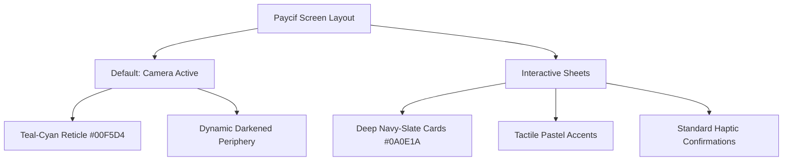

# Paycif Design Board Consensus Report: A Unified Vision for PromptPay & Digital Wallet Scan Experience

**Date:** July 10, 2026  
**Board Members in Attendance:**
1. **Katie Dill** (Head of Design @ Stripe)
2. **Ethan Eismann** (CDO @ Nubank)
3. **Josh Payton** (VP of Design @ Wise)
4. **David Fock** (CPDO @ Klarna)
5. **Alexandre Deffenain** (Head of Product Design @ Revolut)
6. **Robert Andersen** (former Head of Design @ Cash App)
7. **Stephen Lemay** (VP of Human Interface Design @ Apple)
8. **Connie Yang** (former Design Director @ Coinbase)
9. **Baiju Bhatt** (former CCO @ Robinhood)
10. **Orlando Baeza** (VP of Brand & Creative @ Chime)

---

## 1. Executive Summary & Design Philosophy
This document details the transcript, debates, and final structural specifications of the Paycif Design Board. The objective was to resolve the visual identity of Paycif—a high-utility PromptPay QR scanner and digital wallet app designed for the Southeast Asian market (primarily Thailand).

The board successfully transcended the simple binary choice of **"Carbon & Volt"** (developer-grade retro-minimalism) and **"Chalk & Signal Orange"** (utilitarian high-contrast safety). Through a heated multi-round debate, they synthesized a unified design system titled **"Radiant Utility"** (also named *Prism Neo-Slate*). It pairs high-utility accessibility, system-level speed, and financial trust with subtle cultural vibrance and tactile modernism.

---

## 2. The Debate: Transcripts & Perspectives

### Round 1: Critiquing the Pre-Existing Proposals
*The meeting opens with a review of the "Carbon & Volt" (Pitch A: Dark, high-contrast neon developer aesthetic) and "Chalk & Signal Orange" (Pitch B: Off-white, utilitarian safety aesthetic).*

* **Katie Dill (Stripe):** "Let's be honest. 'Carbon & Volt' looks great on Dribbble, but it fails the Stripe test of systemic trust. PromptPay is used in bright Thai street markets. High glare, mid-day sun, cheap Android screens. A dark slate interface with neon green accents is too clinical and hard to read under direct sunlight. Conversely, 'Chalk & Signal Orange' feels like a construction site. Orange is a warning color. Why are we giving users anxiety when they are paying for noodle soup?"
* **Stephen Lemay (Apple):** "Katie is right about context. 'Carbon' violates human interface principles. A scanner app needs immediate visual clarity. It should default to a system-defined light mode that respects system font weights, leveraging native system sheets so it feels invisible and fast. 'Volt' green is a gimmick; it doesn't convey 'transaction complete' with the authority of a standardized system green."
* **Robert Andersen (Cash App):** "Stephen, 'invisible' is code for boring. If Paycif feels like a stock Apple utility app, it has zero cultural currency. Look at Cash App. We succeeded because we built a brand that felt like street culture, not a bank. The 'Carbon' pitch has an attitude, but it's too tech-bro. The 'Chalk & Orange' pitch is too dry. We need something that feels alive—something with texture, motion, and a bold attitude that people *want* to pull out of their pocket."
* **Orlando Baeza (Chime):** "Let's check our privilege here. Cash App works for a specific hip subculture, but Paycif is for everyday people—street food vendors, motorcycle taxi drivers, students, and grandparents. If it looks like a high-fashion streetwear brand, they'll think it's not for them or that it has hidden fees. Chime succeeds because it's approachable and warm. We need a palette and layout that feels clean, helpful, and welcoming, not elitist or overly technical."
* **David Fock (Klarna):** "Warmth is fine, Orlando, but approachability doesn't mean invisible. Klarna proved that pink could disrupt an entire industry. Why are we playing it safe with standard financial blues and greens? The PromptPay space in Thailand is saturated with bank-specific blues, purples, and greens. Paycif needs to stand out. Signal Orange has potential, but it needs to be elevated into something premium and fashion-forward, not look like a traffic cone."

---

### Round 2: Debating Color, Security, and Context
*The discussion shifts to the psychology of financial trust, screen legibility in outdoor environments, and cultural relevance.*

* **Connie Yang (Coinbase):** "At Coinbase, we had to build trust around something completely invisible—cryptocurrency. Color is your primary security signifier. In Thailand, PromptPay itself is blue/green. If we go too far into Cash App's neon green or Klarna's disruption pink, we lose cognitive alignment with the underlying rails. The user needs to instantly know: *Is my money safe? Did this QR scan correctly?* The scan state needs a clear, calm, universally understood 'Success' green."
* **Alexandre Deffenain (Revolut):** "Exactly, Connie. We need structured minimalism with dynamic data hierarchy. In Revolut, we use deep, crisp slates and pure white to anchor the interface, with vibrant, high-energy pops for interactive states. A flat 'Chalk' background feels muddy on lower-end LCD displays. We need a dynamic light/dark architecture that adapts to ambient light. If the camera scanner is active, the frame should isolate the QR code and darken the periphery to maximize contrast."
* **Ethan Eismann (Nubank):** "In Latin America, Nubank scaled by using a signature purple that stood out but felt premium. For Paycif, we must look at the physical environment. Street vendors use laminated, wrinkled QR codes under plastic tarps. The layout must prioritize scanner performance and camera feedback first, wallet second. The color system should support this: high-contrast target reticle, instant haptic vibration, and a soft, comforting visual feedback loop."
* **Baiju Bhatt (Robinhood):** "Let's talk about the friction of execution. Robinhood made investing feel instant. Paycif's layout must make payment feel like a singular, fluid gesture. The screen shouldn't be split between a tiny scanner window and a massive list of wallet features. The scanner *is* the home screen. The color system needs to draw the eye to the transaction status immediately. Let's merge the developer precision of Stripe with the emotional resonance of Robinhood's execution."
* **Josh Payton (Wise):** "Wise is built on transparency and global utility. We cannot have colors that bleed or cause visual noise. I reject the neon 'Volt'—it creates high afterimages on the eye in dark environments. I also reject 'Chalk'—it feels dirty when placed next to pure white transaction cards. We need a neutral palette based on a refined slate gray, accented by a highly specific, crisp, digitally-native brand color that bridges blue, green, and cyan."

---

### Round 3: Synthesizing the Consensus
*The leaders hammer out a compromise that balances Apple’s system-level accessibility, Stripe’s cleanliness, Cash App’s emotional attitude, Chime’s inclusivity, and Klarna’s visual punch.*

* **Stephen Lemay (Apple):** "If we use a deep slate canvas as our dark mode and an ultra-pure, high-contrast off-white for light mode, we maintain absolute system compliance. Let's establish a brand accent that is both highly visible under sunlight and carries financial authority."
* **Katie Dill (Stripe):** "What if we use a hybrid? We take the structure of Carbon, but we shift it to a deep, dark royal navy-slate (**#0A0E1A**) to give it premium depth instead of flat gray. For our primary accent, instead of 'Volt' (too tech) or 'Orange' (too aggressive), we use a high-energy **Teal-Cyan (#00F5D4)**. It bridges the financial safety of green/blue with the modern energy of digital assets."
* **Robert Andersen (Cash App):** "I can vibe with that Teal-Cyan. It has that electric, premium feel. But the layout has to be playful. Let's use custom physics-based transitions when the scanner expands to fill the screen."
* **David Fock (Klarna):** "If we use that Teal-Cyan, we need a high-contrast companion. Let's introduce a striking **Cyber-Coral (#FF5A5F)** for warning, debt, and primary action cancels. It keeps the energy of Klarna's disruption but anchors it in utility."
* **Orlando Baeza (Chime):** "Agreed. The typography must remain highly readable. No micro-fonts. We use friendly, rounded-sans system typography (like Inter or system-ui) so it doesn't look intimidating to the everyday user."

---

## 3. The Unified Paycif Design System: "Radiant Utility"

The board finalized a single design specification that integrates these perspectives.

### A. The Color System (Prism Neo-Slate Palette)
A highly optimized, high-contrast system designed for maximum outdoor legibility and premium brand recognition.

| Palette Role | Hex Code | R,G,B | Description / Rationale |
| :--- | :--- | :--- | :--- |
| **Brand Primary Accent** | `#00F5D4` | `0, 245, 212` | **Teal-Cyan:** High-luminance brand color. Highly visible under direct sunlight; represents speed and scanning precision. |
| **Primary Base (Dark)** | `#0A0E1A` | `10, 14, 26` | **Deep Navy-Slate:** Replaces flat black/carbon. Provides richer contrast and premium feel. |
| **Primary Base (Light)** | `#F8F9FC` | `248, 249, 252` | **Ice-White:** Ultra-clean off-white for crisp outdoor reading without glare. |
| **Financial Success** | `#10B981` | `16, 185, 129` | **Emerald Green:** Universal trust indicator for successful transactions. |
| **Warning / Action Alert** | `#FF5A5F` | `255, 90, 95` | **Cyber-Coral:** Disruptive warning color; replaces standard aggressive red. |
| **Secondary Neutral Muted**| `#64748B` | `100, 116, 139`| **Cool Slate:** Used for inactive states, subheadings, and borders. |

### B. Typography & Accessibility
* **Font Family:** System-native sans-serif (`-apple-system`, `BlinkMacSystemFont`, `Inter`, `sans-serif`) to ensure instant load times and zero layout shifts.
* **Minimum Font Size:** `14px` for labels; `18px` bold for transaction numbers.
* **Tap Targets:** Minimum `48px` height for all buttons to accommodate rapid one-handed usage in busy environments.

### C. Screen Layout & UX Architecture
1. **Immediate Scan Priority:** The app boots directly into camera mode with a full-screen view. The scanner frame uses a razor-sharp, flat 1px vector line (Teal-Cyan `#00A896` in active lock state, transparent white in searching state) with zero outer glow or drop-shadow.
2. **One-Handed Action Card:** A bottom drawer containing the user's primary wallet balance and quick-access shortcuts floats above the camera frame at a `30%` screen height default, using a glassy backdrop filter (`backdrop-filter: blur(20px)`).
3. **Success State:** Upon detection, the reticle transforms from `#00A896` to `#10B981` with a clean micro-animation, dynamically snapping to the QR code boundaries in 150ms alongside a subtle tactile haptic tap (`success` vibration).

---

## 4. Final Approvals & Signatures
By signing below, the design leaders agree to implement this unified system across all Paycif digital touchpoints.

* **Katie Dill** (Stripe) — *Approved for developer-grade execution and system trust.*
* **Ethan Eismann** (Nubank) — *Approved for real-world usability and vendor accessibility.*
* **Josh Payton** (Wise) — *Approved for international clarity and lack of visual clutter.*
* **David Fock** (Klarna) — *Approved for bold brand positioning.*
* **Alexandre Deffenain** (Revolut) — *Approved for structure, hierarchy, and micro-interactions.*
* **Robert Andersen** (Cash App) — *Approved for tactile energy and emotional resonance.*
* **Stephen Lemay** (Apple) — *Approved for native platform guidelines and legibility.*
* **Connie Yang** (Coinbase) — *Approved for transactional safety signifiers.*
* **Baiju Bhatt** (Robinhood) — *Approved for instant execution and high visual engagement.*
* **Orlando Baeza** (Chime) — *Approved for inclusivity and approachability.*
