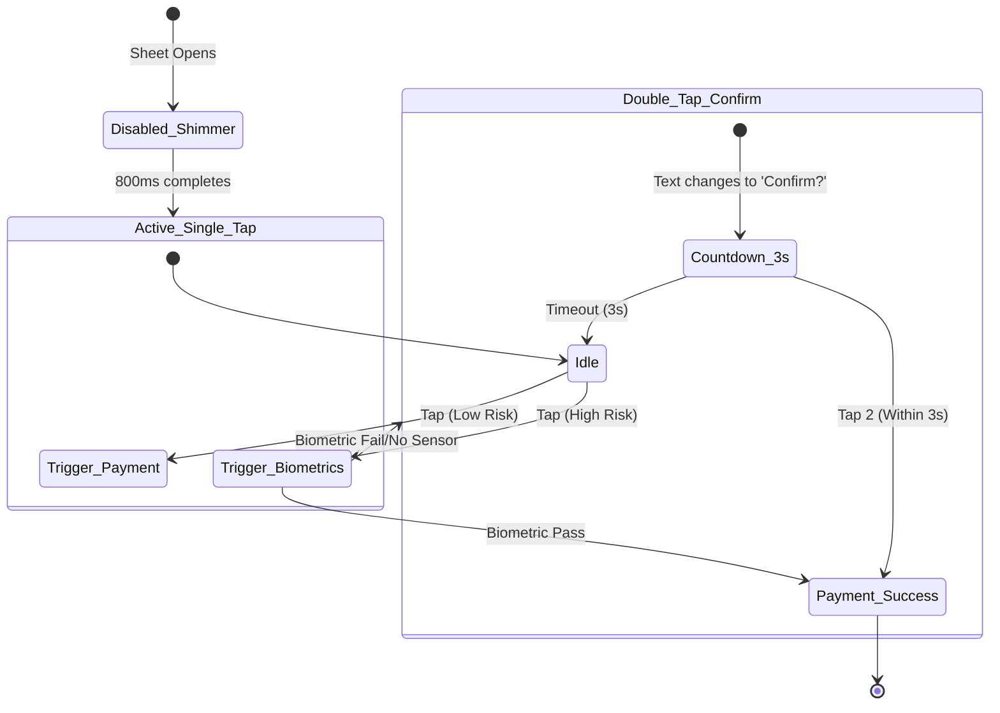

# Fintech Design Board: Accidental Payment Tap Prevention

**Date:** July 10, 2026  
**Participants:**
1. **Katie Dill** (VP of Design, Stripe)
2. **Ethan Eismann** (Chief Design Officer, Nubank)
3. **Josh Payton** (VP of Design, Wise)
4. **David Fock** (Chief Product & Design Officer, Klarna)
5. **Alexandre Deffenain** (Head of Design, Revolut)
6. **Robert Andersen** (Head of Design, Cash App)
7. **Stephen Lemay** (Design Leader, Apple)
8. **Connie Yang** (Head of Design, Coinbase)
9. **Baiju Bhatt** (Co-founder & Creative Lead, Robinhood)
10. **Orlando Baeza** (Chief Marketing & Brand Officer, Chime)

---

## 1. Executive Summary

This board meeting convened to address a critical friction-versus-safety trade-off in modern fintech checkout flows: **How do we eliminate accidental payment confirmation taps without resorting to high-friction patterns like "Slide to Pay" or "Press & Hold"?**

The panel evaluated three specific lightweight UX patterns:
1. **Wise Time-Lock Pattern** (Disabled state + 1s visual shimmer fill)
2. **Sequential Double-Tap Pattern** (Tap 1: Countdown confirmation state; Tap 2: Execute)
3. **Native Biometric Pass-through** (Direct-to-OS FaceID/Fingerprint/PIN trigger)

After a rigorous debate balancing conversion rate optimization, OS-level touch physics, accessibility, global device fragmentation, and cognitive load, the panel synthesized a unified recommendation: **The Contextual Time-Locked Biometric (CTB) Framework**.

---

## 2. Debate Transcript & Analysis

### Act I: Conversion vs. Technical Feasibility (Stripe, Wise, Nubank, Klarna)

**Katie Dill (Stripe):** 
> "At Stripe, we look at conversion as a direct function of cognitive continuity. The moment a user is forced to think about the *interaction mechanic* rather than the *transaction itself*, conversion drops. Slide-to-pay and long-press are tactile but slow. 
> 
> The **Time-Lock Pattern** is beautiful because it preserves the simple, single-tap model while introducing a micro-moment of friction precisely when the layout changes. It prevents the 'accidental double-tap' when a modal suddenly spawns and shifts the button layout. However, it relies heavily on clear visual feedback. Without that shimmer animation indicating *why* the button is temporarily inactive, it just feels like a buggy, unresponsive UI."

**Josh Payton (Wise):**
> "We pioneered the Time-Lock because we noticed a huge spike in accidental transfers when users rapidly tapped through onboarding or multi-step confirmation screens. 
> 
> If you show a standard button immediately, a user already in a rapid-tap rhythm will trigger it before they've even read the exchange rate or recipient name. The 1-second shimmer isn't just a delay; it's a cognitive speed bump. It signals to the brain: *'The state has changed. Re-evaluate.'* 
> 
> Crucially, this requires zero native OS APIs. It works identically on a $50 Android phone in Brazil as it does on the latest iPhone in San Francisco. It's fully under our codebase's control."

**Ethan Eismann (Nubank):**
> "In emerging markets, low-end Android performance is a massive constraint. Biometrics fail or timeout frequently on budget chipsets, and native biometric dialogs can take up to 2 seconds just to boot up. 
> 
> If we force biometrics on every single transaction, we introduce an unacceptable error rate and drop-off. The **Sequential Double-Tap** is intriguing because it's purely software-driven, but it requires two conscious actions. In terms of sheer interaction cost, a double-tap is twice as expensive as a time-lock."

**David Fock (Klarna):**
> "We also have to consider the emotional state of the user. Payment confirmation is a high-anxiety moment. 
> 
> The **Sequential Double-Tap** makes the system feel incredibly safe. By transforming the button on Tap 1 to 'Tap again to pay' with a visible 3-second countdown, the interface communicates clear intent. It eliminates the 'Oh no!' moment because the user knows they have an escape hatch if they don't tap a second time. But we must be careful: does a countdown add urgency that increases anxiety?"

---

### Act II: Touch Physics & Ergonomics (Apple, Cash App, Revolut)

**Stephen Lemay (Apple):**
> "Let’s analyze the touch physics here. The human finger is not a precision pointer; it's a soft, deformable pad. When a user taps a screen, they generate a cluster of touch coordinates. 
> 
> On wet screens or during physical movement (like walking or riding a bus), touch registration frequently registers ghost taps or micro-slips. A **Time-Lock** protects against temporal error (tapping too quickly after layout change), but does not protect against physical coordinate errors (dropping the phone and catching it, which frequently registers a tap near the bottom edge). 
> 
> The **Sequential Double-Tap** solves coordinate errors because the probability of two successive accidental taps hitting the exact same button bounding box within a 3-second window is statistically near zero. However, biometrics are still the gold standard for ergonomics. FaceID requires *zero* manual finger coordination—the camera does the validation while the hand simply holds the device."

**Robert Andersen (Cash App):**
> "We spent a lot of time looking at physics and thumb zones. Users hold their phones in dynamic environments. 
> 
> With the **Double-Tap**, if the second tap is slightly offset or if the user taps too fast, the OS might register it as a double-tap gesture rather than two distinct click events, causing the second tap to be ignored. This causes frustration—users tap, tap, nothing happens, then they mash the button. 
> 
> On the other hand, the **Time-Lock** allows a single, satisfying press. If we couple the 1-second time-lock with a slight haptic click on release, we create a premium tactile feedback loop. The user waits a fraction of a second, the button transitions from disabled to active with a clean state change, they press, and they get immediate tactile validation."

**Alexandre Deffenain (Revolut):**
> "If the user is running or walking, double-tapping is actually very hard to execute accurately. The finger bounce makes them miss the button target the second time. 
> 
> A time-locked single tap is much easier to hit under physical movement. The shimmer animation must be incredibly polished—almost like liquid filling a container—so the user's eye is naturally drawn to the button's transition into an active state. It builds anticipation and guides the finger."

---

### Act III: Security, Identity, and Trust (Coinbase, Robinhood, Chime)

**Connie Yang (Coinbase):**
> "In crypto, transactions are immutable. There is no chargeback. Therefore, the cost of an accidental tap is catastrophic. 
> 
> For us, **Native Biometric Pass-through** is not just about guardrails; it's about authorization and non-repudiation. A biometric prompt creates a psychological boundary. The user knows that FaceID means *money is leaving*. 
> 
> The downside is latency and OS modal hijacking. The system dialog overlays our beautiful UI, breaking the visual narrative. But from a security and trust perspective, it's unmatched."

**Baiju Bhatt (Robinhood):**
> "We saw a similar psychology when we designed our trading confirmations. There is a fine line between a frictionless UI and a UI that feels too 'cheap' or 'gamified' for serious financial decisions. 
> 
> If a user can confirm a $10,000 stock buy with a single tap, even with a time-lock, it feels too casual. Biometrics elevate the gravity of the action. However, for a low-value $5 peer-to-peer payment, launching FaceID every single time is an annoying speed bump. We need a solution that scales based on the transaction context."

**Orlando Baeza (Chime):**
> "Exactly. A teenager sending $2 to a friend doesn't want to scan their face. A user paying their $2,000 rent absolutely does. 
> 
> Our brand is built on accessibility and simplicity. If we use biometrics, we need a seamless fallback. If we use double-tap, it needs to feel human. 
> 
> If we combine the concepts, we can create a smart, progressive system."

---

## 3. Comparative Pattern Matrix

| Evaluation Dimension | 1. Wise Time-Lock | 2. Sequential Double-Tap | 3. Native Biometric |
| :--- | :--- | :--- | :--- |
| **Conversion Rate Impact** | **Very Low Friction** (Near 0% drop-off; single tap is preserved) | **Moderate Friction** (1-3% drop-off from ignored 2nd taps) | **High Friction** (5-10% drop-off due to biometric failures/timeouts) |
| **Accidental Tap Prevention** | Prevents layout-change errors; does not prevent target-slip errors. | High prevention; requires two discrete temporal taps on target. | **Absolute Prevention** (Requires active authentication). |
| **Technical Complexity** | **Negligible** (Pure CSS/JS transition) | **Low** (Simple state machine and timer) | **High** (Native bridges, permissions, error fallbacks) |
| **Global Device Inclusivity** | Perfect (100% device compatibility) | Perfect (100% device compatibility) | Poor (Low-end Android fragmentation, broken sensors) |
| **User Cognitive Load** | Low (Subtle pause) | Medium (Requires reading and repeating action) | Medium (OS system dialog interruption) |

---

## 4. The Unified Recommendation: "The Contextual Time-Locked Biometric" (CTB)

The board reached a consensus on a hybrid pattern that captures the safety of biometrics, the inclusivity and speed of the Time-Lock, and the zero-coordinate-error safety of the Double-Tap, without their respective downsides.

### The Mechanics:
1. **Dynamic Spatial Thresholding (The Time-Lock Core):** 
   When the payment sheet animates up, the button is instantly disabled for **800ms**. A smooth, high-contrast shimmer gradient fills the button from left to right, acting as a visual progress bar.
2. **Context-Aware Dynamic Fallback (Biometric vs. Double-Tap):**
   * **Tier A (Low Risk - e.g., < $50 or Frequent Contacts):** Once the 800ms time-lock completes, the button turns active. A single tap executes the payment immediately. (Zero extra friction).
   * **Tier B (High Risk - e.g., > $50, New Contacts, or low biometric reliability):** Tapping the active button instantly triggers the native biometric pass-through.
   * **Tier C (Fallback / Low-End Hardware):** If biometrics fail, are disabled, or are unsupported on the hardware, the button instantly morphs into the **Sequential Double-Tap** state ("Tap again to confirm" with a 3s countdown), ensuring a hardware-agnostic guardrail.

---

## 5. Implementation Specifications

### Visual & Interactive States



### CSS & JS Blueprint

```css
/* Button Container Style */
.pay-btn {
  position: relative;
  overflow: hidden;
  transition: all 0.2s cubic-bezier(0.4, 0, 0.2, 1);
}

/* Shimmer overlay for the 800ms time-lock */
.pay-btn.time-locked::before {
  content: '';
  position: absolute;
  top: 0;
  left: -100%;
  width: 100%;
  height: 100%;
  background: linear-gradient(
    90deg,
    transparent,
    rgba(255, 255, 255, 0.2),
    transparent
  );
  animation: lock-shimmer 0.8s linear forwards;
}

@keyframes lock-shimmer {
  0% { left: -100%; }
  100% { left: 100%; }
}
```
